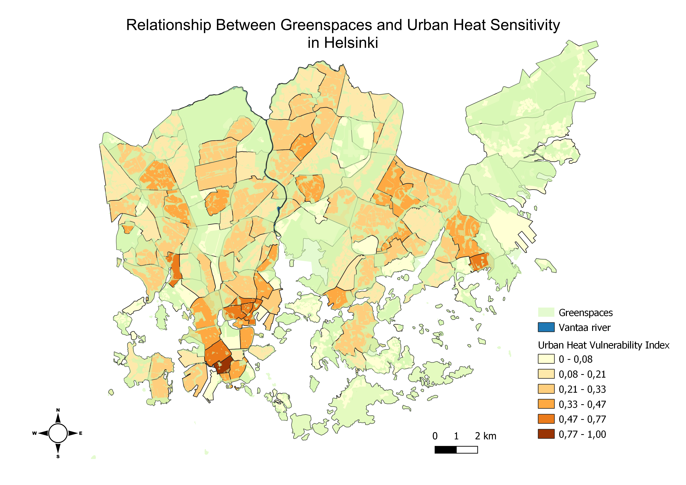
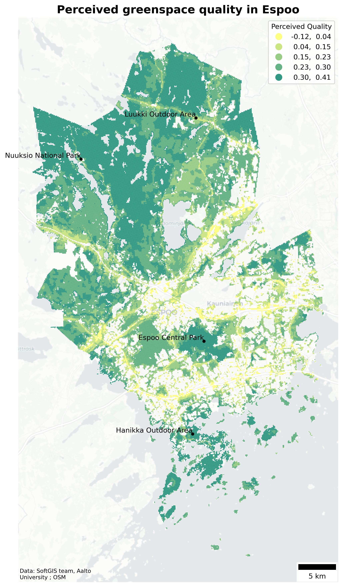
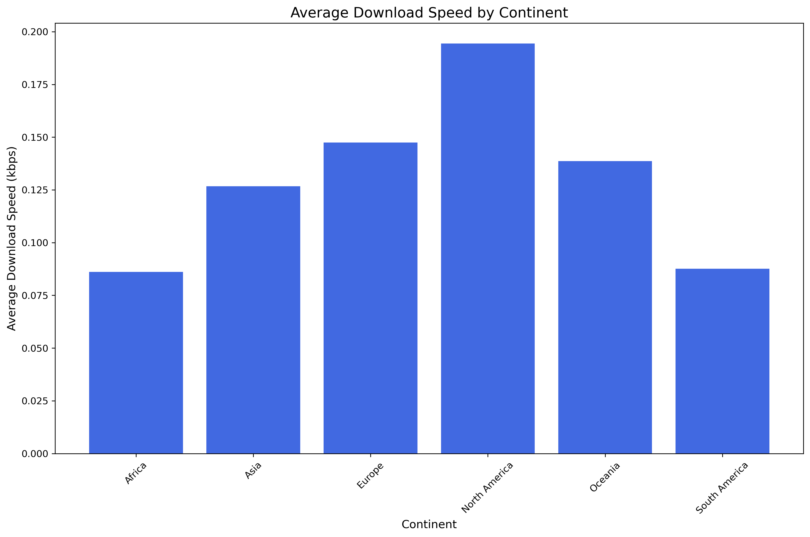
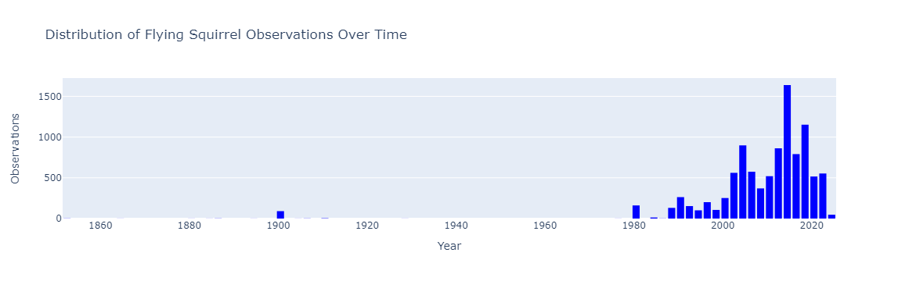
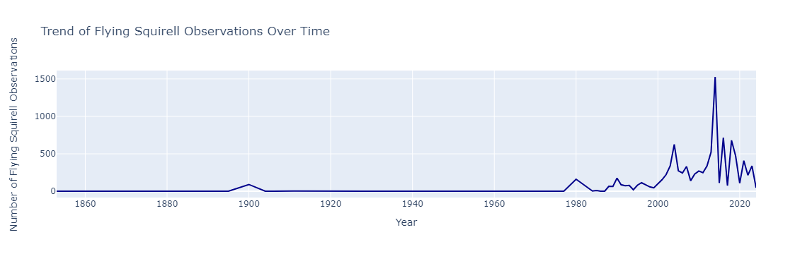
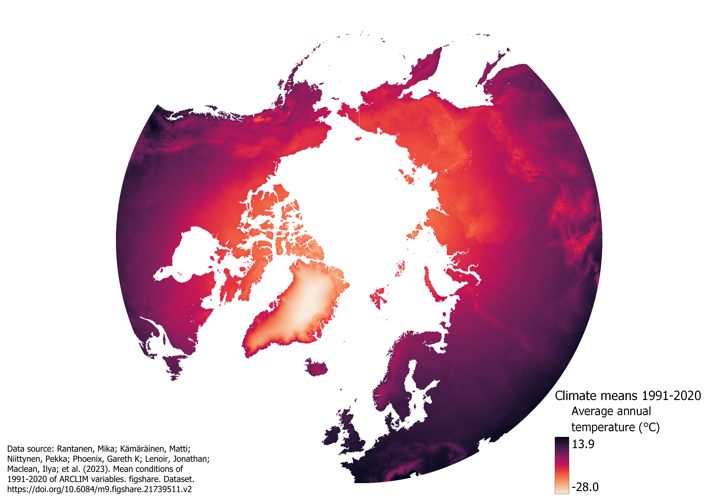
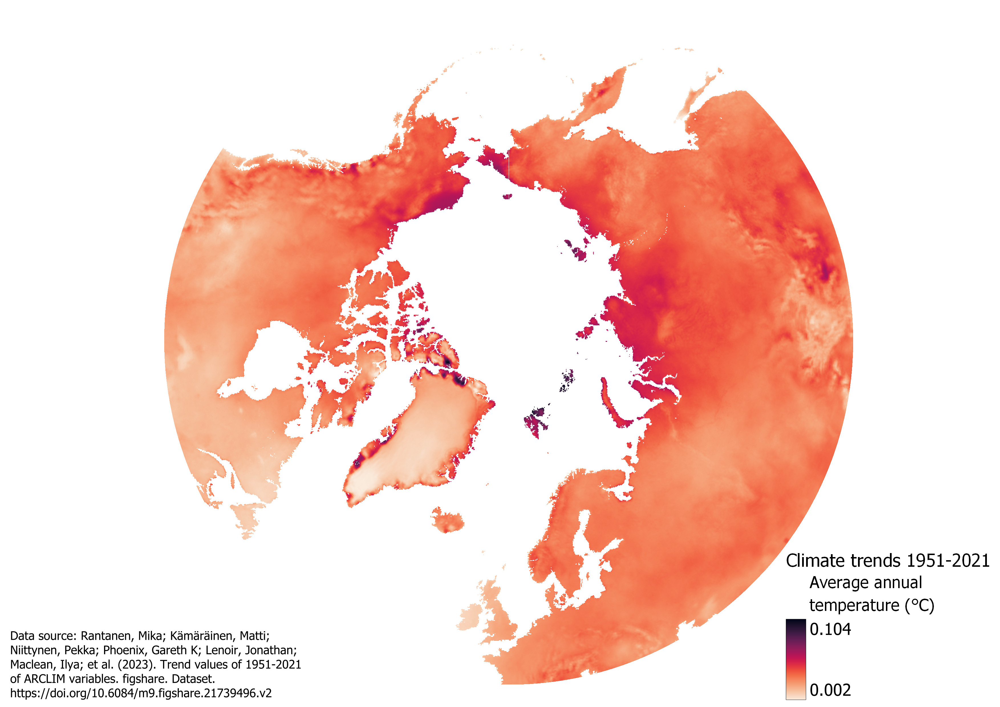
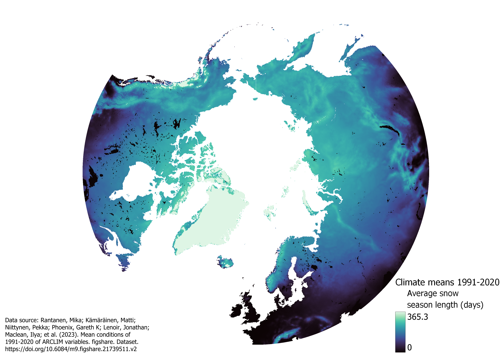
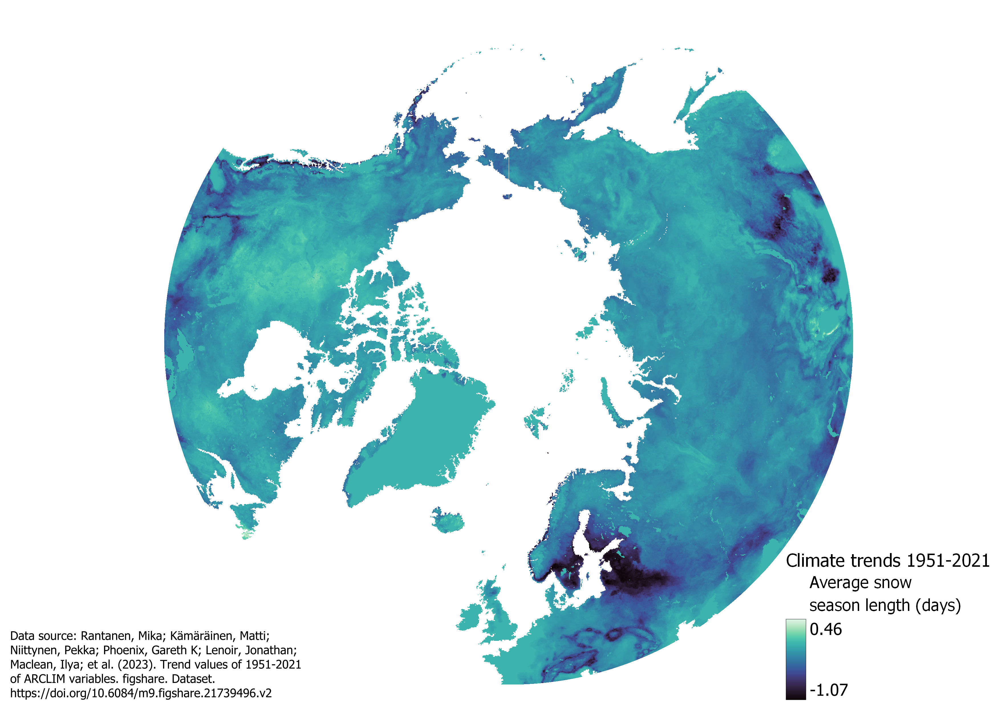

# GEOG-349_portfolio
Portfolio for course GEOG-349

The course consisted of four weeks of lectures and discussion sessions where we learned about cartographic principles and how to make visually pleasing and informative maps. The maps could be done with QGIS or with Python. I ended up using both of these methods during the course as well as for the final portfolio. This repository, or GitHub page, contains a compilation of the weekly exercises and a summary of their reflections, description of the data used during the course and the portfolio, an introduction to the final work done and what kinds of visualizations were done in addition to a conclusion which summarizes the final work.  

## Table of contents
- [Compilation of weekly excersices](#compilation-of-weekly-excersices)
  - [Week 1](#week-1)
  - [Week 2](#week-2)
  - [Week 3](#week-3)
  - [Week 4](#week-4)
- [Final work](#final-work)
  - [Introduction to topic](#introduction-to-topic)
  - [Results and visualizations](#results-and-visualizations)
  - [Conclusions](#conclusions)
- [Data description](#data-description)
  - [Week 1](#week-1)
  - [Week 2](#week-2)
  - [Week 3](#week-3)
  - [Week 4](#week-4)
  - [Final work](#final-work)

## Compilation of weekly excersices
### Week 1
On the first week of the course, we discussed the elements of a good map. There are several elements that are needed for “good” maps which have been ingrained into our brains since comprehensive school. For example, in my matriculation exam there was a question on what the visual elements of a well-made map are. Basic map elements usually included in maps are map title, legend, scale, orientation, metadata, and index map. However, not all these elements are always necessary, and their inclusion depends on the context and use of the map. For example, if the spatial orientation of the map is known, a north arrow is not necessary (e.g. global maps). In addition to map elements, the colours used in maps are also very important. Depending on the colours chosen, the map maker can influence the reader’s perception of the topic. This however depends also on the culture, but for example, western readers green symbolizes positive phenomena while red has a more negative connotation. In addition to the feelings that are associated with colours, map makers need to also make sure that their maps are as accessible as possible and for example colour blind people can interpret them without problems.    
As our first assignment we had to create a thematic map which can be seen in Figure 1. The most difficult part of the assignment was to find the data as we could visualize whatever we wanted. I ended up visualizing the Urban Heat Vulnerability Index with urban greenspaces in Helsinki with QGIS to see whether there is any connection between them. The visualization is not the best one as it is missing the source of the data, and the transparency of the greenspaces layer doesn’t quite work. The data was visualized with 6 classes with the classes being divided according to natural breaks. The visualization uses a yellow-orange-brown colour gradient to communicate warmth associated with heat. The colour ramp was edited because I felt that the colours of some middle classes were too dark in comparison to what kinds of values they represent. The thematic map depicts the relationship between heat vulnerability and greenspaces in Helsinki. The map shows clear trends of higher index values in city districts with fewer greenspaces and lower index values in districts with more greenspaces.    

*Figure 1. Map visualizing whether there could be any relation between greenspaces and
vulnerability to heat in Helsinki.*    
### Week 2
On the second week of the course, we talked a lot about colours and visual hierarchy as well as what needs to be considered when a map is printed versus when it is published online. The major difference between printed and online maps is whether the used color scheme is created by mixing light (e.g. RGB, used in online maps) or by subtracting light (e.g. CMYK, used in printing). The colours in different systems can look very different and sometimes even journals publish CMYK maps so it is critical to know where the made map will be published to be prepared on how it will visually look. On the other hand, visual hierarchy is a theory on where and which order will the reader pay attention to in a map.    
I coded my second map in Figure 2 on perceived greenspace quality across the city of Espoo with Python. The perceived quality is visualized with an overall sentiment score which is calculated by simply subtracting the probability of feeling negative with the probability of feeling positive. Thus, larger values would indicate more positive sentiments while smaller values would indicate fewer positive sentiments of the quality of the greenspace. The map uses the WebMercator coordinate reference system since it is the only system where the background map also works in. The map utilizes the summer colour scheme where more positive sentiments get greener values while negative sentiments are yellow. The values are classified with Fisher-Jenks, and at this point I hadn’t learned to fine tune the position of the legend, so it is in the upper right corner. All in all, the map reveals how the quality of different greenspaces are perceived in Espoo.    

*Figure 2. Perceived greenspace quality in Espoo*   
### Week 3
On the third week of the course, we discussed story telling with maps, and what kind of emotions maps can evoke in us. In my opinion, although it is quite impossible, maps should strive to be as neutral as possible in the way they present information. My view most likely stems from the fact that I see maps as tools to present information, even though they can be much more like a means for propaganda or satire. I see a map having a story line, personal aspects, and a climax, as leading the reader to make the conclusions you want them to make which brings us the topic of how to lie with maps. Also, I feel like including all these aspects would have a negative impact on the minimalism and clarity of the map. Additionally, we discussed different ways to visualize geographical data. Visualizing geographical data without losing the spatial aspect of the data is somewhat difficult. For example, non-cartographic methods, such as line charts or network graphs and chord diagrams, can be more effective for visualizing and communicating movement, trajectories, or connections compared to traditional maps. Otherwise, spatial patterns are difficult to visualize without cartographic methods. Cartographic map visualizations can be augmented with other visualizations, but those methods can’t really represent on their own spatial patterns, only give an overview of the phenomenon or it’s temporal development in some location.    
I did my maps again with Python. I chose to visualize internet speed data on a hexbin map. I made a map for Europe (Figure 3), a global map (Figure 4), and a bar plot representing the average download speeds on each continent (Figure 5). The dataset was very large, so I filtered out all the data over the 95 % percentile as there seemed to be very large values that made the visualization difficult. I used the BrBG colour scheme and classified the data into 6 classes with quantiles. The maps are in the WebMercator projection, since I again had problems getting the background map to work in any other projection. It is important to note that the Mercator projection distorts sizes, especially towards the poles which is why it is not really optimal as it influences the way people see the world. From the different maps, the patterns of downloading speed are easier to see from the Europe map as in the global map the zoom needs to be as general as possible since the visualization is not interactive. The trends in the maps are quite interesting. In Europe, especially inside EU countries, bigger cities have higher downloading speeds. In contrast, slower downloading speeds can be found in eastern Europe, Ireland, northern Africa, and the Finnish countryside. On a global scale, the higher downloading speeds are in northern America, the Arabian Peninsula, East Asia, and Australia. The high internet speeds in East Asia can’t be distinguished from the bar plot since the internet speeds of India and Southeast Asia are quite slow. This adds to my previous argument that non cartographic visualization methods lose information on spatial data, especially if we generalize areas to continents like this. The global map also highlights the underrepresentation of some regions in big data.    

*Figure 3. Normalized average download speed in Europe*   

*Figure 4. Global normalized average download speed*   

*Figure 5. Normalized average download speed by continent*   
### Week 4
On the last week of the course, we discussed further different ways of visualizing geospatial data and future trends in cartography. We for example delved deeper into interactive maps and data classification. We discussed how classifying data in different ways impacts visualization and hides or brings up different trends. Thus, data classification is one of the tools one can use to lead the reader into making certain conclusions. For example, choropleth maps might look very different when classified with equal interval versus natural breaks with equal intervals not often bringing out any trends within the data. In the discussion session we further discussed future trends in cartography or how we thought that the field would look like in 2030. As this year is very close by, our group didn’t believe that AI would have time to revolutionize the field. We thought more on the lines that it will generate massive amounts of nonsense data which will decrease data quality. We also wondered if the current geopolitical tensions continue to rise, how would it impact the resolution and quality of open data in the future.   
In honour of the last week, we made interactive maps in addition to non-cartographic visualizations with Python. I made two noncartographic visualizations and three interactive maps on flying squirrels. I made a bar plot (Figure 6) and a line plot (Figure 7) for visualizing the squirrel observations over time. As observed from the figures, most of the observations are made after the 90s, with most observations made in 2014 – 2015. Since these plots don’t give any information on the spatial patterns of the data, I visualized those with additional interactive maps. [The first map](https://ainoschulz.github.io/GEOG-349_portfolio/squirrel_map_1.html) combines temporal and spatial information showing yearly squirrel observations on a map. [The second map](https://ainoschulz.github.io/GEOG-349_portfolio/squirrel_map_2.html)  combines noncartographic and cartographic visualizations by showing the number of yearly squirrel observations in different regions. This map is not really the best as the plots aren’t really scaled in the same way and information on the spatial distribution is lost. [The third map](https://ainoschulz.github.io/GEOG-349_portfolio/squirrel_map_2.html)  is a heat map that gives information on the spatial distribution and intensity of flying squirrel observations but loses temporal information. All in all, the different maps provide different information on flying squirrel observations in Finland.    

*Figure 6. Distribution of flying squirrel observations over time.*   

*Figure 7. Trend of flying squirrel observations over time.*   

## Final work
### Introduction to topic
As my final work I wanted to investigate the changes in the Arctic. I first stumbled upon the GBIF dataset and thought that it could be interesting to visualize the changes in species distribution of two representative Arctic species, the Arctic Fox and Polar Bear. Since the ARCLIM dataset also seemed interesting and it concentrates on the same region where the studied species are found, I thought about how I could incorporate it to my other datasets. I first wanted to make an interactive visualization with yearly mean temperatures and species observations. However, because the ARCLIM dataset is so large, this proved not to be feasible as the resulting html file wouldn’t open and could not be uploaded to GitHub due to its size. Thus, I decided to do a more simpler analysis that wouldn’t produce too large file sizes.    
I made maps with the ARCLIM dataset in QGIS using the mean and trend files. Both of these files include 18 bands which represent different measured variables. Considering my interest in visualizing the spatio-temporal patterns of Arctic Fox and Polar Bear observations, I decided to visualize the bands on snow season length and annual mean temperature. I felt like these layers would most likely have the most significant impact on the species. These layers, however, only provide a general overview of the region and the observed trends. It could have been interesting to also make a time series of yearly mean temperatures, but this was abandoned due to the large size of the file. On the other hand, the species data was handled with Python. The changes in species observations were visualized with bar plots, to show the temporal variation of species observations, and with interactive maps, to show the spatial variation in species observations. The goal of the maps is to provide insights into the changes happening in the Arctic with the help of climatic variables as well as species observations.
### Results and visualizations
My first set of figures depict mean values and trends of climatic variables in the Arctic. Figure 8 shows the average temperature between 1991 – 2020. We see that the temperature varies on a large scale, from -28.0˚C, mainly in the middle of Greenland, to 13.9˚C in the British Iles and Middle Europe. The scale bar for the temperature is maybe not the best as one cannot clearly see what colours represent what temperatures, but as the data comes from a tiff file the options on how to express the values are limited in QGIS. The darker colours indicate higher temperatures and bigger changes while lighter colours indicate lower temperatures and smaller changes. Overall, the mean temperatures follow what is expected, average temperatures towards the poles are colder. In addition, mountain ranges can be distinguished with lower temperatures, for example the Alps, the Scandes, and the Ural Mountains. Figure 9 illustrates what are the trends of the average temperatures between 1951 – 2021. The values here vary very little, from 0.002˚C to 0.104˚C, but the trend is positive which indicates that the average temperatures have been slowly rising. Interestingly enough, the smallest changes seem to be in southern Greenland. On the other hand, the largest changes are observed on the western and northern coasts of Greenland, Svalbard, and Franz Josef Land. Otherwise, the average temperatures in the northern Hemisphere have been slightly rising.   

*Figure 8. Average annual temperature between 1991-2020*   

*Figure 9. Trend in average annual temperature between 1951-2021*   
Figure 10 shows the average length of snow season between 1991 – 2020 while figure 11 shows the trends in the length of snow season between 1951 – 2021. The length of snow season is measured in days. The darker colours in the figures indicate less snow-covered days and more negative trends in the number of snow-covered days while the lighter colours indicate a larger number of snow-covered days and a more positive trend in the number of snow-covered days. The range of the average length of snow season is from 0 to 365, so in some regions there is snow cover all year round. These places include for example most parts of Greenland, Svalbard, and Novaya Zemlya. Other places with longer average length of snow season include northern Canada, the Alaska Range, Siberia, the Alps, and Iceland. Regions with no snow are mainly situated at lower latitudes. In addition, the water bodies seem to be masked out and get values of zero. The trends in the Norther Hemisphere are also very interesting. The most apparent results are that southern Norway, Sweden, and Finland, as well as the Baltic countries and areas in the Alps have lost 1 snow-covered day on average. Other areas with negative trends can be found on the west coast of Alaska and southern Russia or Mongolia and China. Otherwise, the length of the average snow season has been quite stable, with even some positive trends detected mainly in northern Canada.   

*Figure 10. Average length of snow season between 1991-2020*   

*Figure 11. Trend in average length of snow season between 1951-2021*   
My second set of figures show the temporal and spatial evolution of two Arctic species, the Arctic Fox and Polar Bear. All these figures are interactive and can be accessed by pressing the links shown underlined in blue. [Figure 12](https://ainoschulz.github.io/GEOG-349_portfolio/arctic_fox_observations_plot.html) shows the distribution of Arctic Fox observations over time. We see that most observations were made between 1950 – 1963. After this there is a quieter time period, with a new peak in the 90s and early 2000s as well as post 2012. It is quite interesting that there are so many observations post 2012 which have been dubbed as the hottest decade. This also raises the question of how the observations have been made and whether the methodology has changed over time, which explains the fluctuations in population or whether these are the trends actually happening. The trend of Polar Bear observations in [Figure 13](https://ainoschulz.github.io/GEOG-349_portfolio/polar_bear_observations_plot.html) is also intriguing. Here the trend has been quite stable with a peak in observations around the 70s and the most observations made in 2005. Compared to the Arctic Fox, the population of Polar Bears is smaller with fewer observations made. It also doesn’t seem like the population has been declining. In this figure as well as figure 12 the number of observations for 2024 is very small, but this is because we are only halfway through 2024.   
On the other hand, [Figure 14](https://ainoschulz.github.io/GEOG-349_portfolio/arctic_fox_observations_map.html) and [Figure 15](https://ainoschulz.github.io/GEOG-349_portfolio/polar_bear_observations_map.html) show the spatial variation of both species. Both of these maps underline the issues with the coordinate accuracy of GBIF data with Arctic Fox observations made near Florida and Denmark, as well as Polar bear observations made in the Great Lakes region and near southern Finland. For these reasons the results need to be critically evaluated before making any definite conclusions. GBIF has been known to have issues such as misplaced coordinates and lacking the precision needed for fine-scale studies. In addition, there can be misidentifications, outdated records, and variability in data quality. Looking at [Figure 14](https://ainoschulz.github.io/GEOG-349_portfolio/arctic_fox_observations_map.html), the observations of Artic Fox seem to be done in quite similar locations in the high latitudes. The most variability of locations seems to be in the 2000s with many observations made for example in Iceland, Norway, and Svalbard. Before the 2000s the observations are made from much fewer locations. As we know this is not due to the overall observations being made, so it could be due to the missing location information and many observations getting the same approximate coordinates. As for [Figure 15](https://ainoschulz.github.io/GEOG-349_portfolio/polar_bear_observations_map.html), most of the Polar Bear observations seem to be made in Alaska and Northern Canada before the 80s. After the 80s observations are also made in Greenland, Svalbard, and northern Russia. These trends could be due to the geographical or effort bias of GBIF with different areas being studied at different times.   

 
### Conclusions
All in all, the goal of these maps and figures is to shed light on the changes happening in the Northern Hemisphere and especially the Arctic. The analysis of climatic data and species highlighted several trends and issues. Firstly, the mean annual temperatures have shown a slight warming trend between 1951 – 2021, with significant regional variations. The warming is most pronounced in areas such as the western and northern coasts of Greenland, Svalbard, and Franz Josef Land. These regions are experiencing the most rapid temperature increases which could affect their local ecosystems and species. The length of the snow season also shows notable trends. While some regions like southern Norway, Sweden, Finland, and the Baltic countries have experienced a decrease in snow-covered days, northern Canada has shown stable or even increasing snow season lengths. These changes in snow cover can directly affect the habitat of Arctic species, as snow cover is crucial for species like the Arctic Fox and Polar Bear.   
The analysis of species distribution data from the GBIF database revealed some temporal and spatial variations in observations. Arctic Fox observations have varied over time, with notable peaks in the 1950s-1960s and the early 2000s. The recent increase in observations post-2012 raises questions about the potential impacts of recent climatic changes on their distribution and whether changes in observation methodologies cause some of the fluctuations. Polar Bear observations show a somewhat stable trend with peaks in the 1970s and 2005. However, the overall number of observations is lower compared to the Arctic Fox, indicating a smaller population and potentially more restricted distribution. The spatial analysis revealed that most Polar Bear observations have been concentrated in Alaska and Northern Canada before the 1980s, with later observations extending to Greenland, Svalbard, and northern Russia. This could indicate a geographical bias in study efforts over different time periods.   
Despite these insights, the study also noted significant issues with the GBIF dataset. Misplaced coordinates and lack of precision present challenges for fine-scale studies. For instance, there were observations of Arctic Foxes near Florida and Denmark, and Polar Bears in the Great Lakes regions and southern Finland, highlighting the need for critical evaluation of data before making definite conclusions. In addition, the analysis faced limitations due to the large size of the ARCLIM dataset, which constrained the possibilities of interactive visualizations combining climatic data with species observations. Overall, the combined use of climatic and species observation data provides insight into the ongoing changes in the Arctic. However, it also emphasizes the need for careful data handling and critical assessment to ensure the reliability of conclusions drawn from such analyses. The Arctic continues to be an interesting study area with sensitive ecosystems are adapted for specific conditions that are changing at a remarkable pace.   

## Data description
### Week 1
The map of week 1 used a heat vulnerability dataset from Helsinki InfoShare, and a greenspace layer from the Helsinki City WFS. The index is measured as a function of exposure, sensitivity, and adaptive capacity.   
[Urban Heat Vulnerability Index of Helsinki](hri.fi/data/en_GB/dataset/helsingin-lampohaavoittuvuusindeksi). The maintainer of the dataset is Helsingin kaupunginkanslia. The dataset has been downloaded from Helsinki Region Infoshare service on 09.06.2024 under the license Creative Commons Attribution 4.0.   
### Week 2
The map of week 2 used a PPGIS dataset collected by Kajosaari et al. (2024). It consist of two main attributes: probability for positive perceived quality and probability for negative perceived quality.    
Kajosaari, A., Hasanzadeh, K., Fagerholm, N., Nummi, P., Kuusisto-Hjort, P., & Kyttä, M. (2024). Predicting context-sensitive urban green space quality to support urban green infrastructure planning. Landscape and Urban Planning, 242, 104952. [https://doi.org/10.1016/j.landurbplan.2023.104952](https://doi.org/10.1016/j.landurbplan.2023.104952)     
### Week 3
Maps of week 3 use internet speed data provided by Ookla from the first quarter of 2022. No metadata was found, and only the information on downloading speed was thus used.   
Data downloaded from Ookla in parquet format using [link.](https://ookla-open-data.s3.us-west-2.amazonaws.com/parquet/performance/type=mobile/year=2022/quarter=1/2022-01-01_performance_mobile_tiles.parquet)    
### Week 4
Maps of week 4 use flying squirrel data from Metsähallitus. Data includes flying squirrel observations with geometric information from a large time scale. The data was downloaded form the link on the course page and more information on the data can be found from the page of [Metsähallitus](https://www.metsa.fi/en/project/flying-squirrel-life/flying-squirrel-information/)    
### Final maps
For the final maps data from two different websites were used. For the static maps data from ARCLIM was downloaded. In the visualization mean values of 1991 – 2020 and trend values of 1951 – 2021 were used to visualize snow season lengths and annual mean temperature. Snow season length is expressed in days and annual mean temperature in Kelvins, but it was visualized in Celsius degrees. For the interactive maps data from Global Biodiversity Information Facility (GBIF) was used to study the spatial and temporal variations in Arctic Fox and Polar Bear observations. The data includes multiple variables, including geometric information. It is critical to note that the dataset has imprecise coordinates which can be seen in the maps.    
Rantanen, Mika; Kämäräinen, Matti; Niittynen, Pekka; Phoenix, Gareth K; Lenoir, Jonathan; Maclean, Ilya; et al. (2023). Mean conditions of 1991-2020 of ARCLIM variables. figshare. Dataset. [https://doi.org/10.6084/m9.figshare.21739511.v2](https://doi.org/10.6084/m9.figshare.21739511.v2)    
Rantanen, Mika; Kämäräinen, Matti; Niittynen, Pekka; Phoenix, Gareth K; Lenoir, Jonathan; Maclean, Ilya; et al. (2023). Trend values of 1951-2021 of ARCLIM variables. figshare. Dataset. [https://doi.org/10.6084/m9.figshare.21739496.v2](https://doi.org/10.6084/m9.figshare.21739496.v2)    
GBIF.org (03 June 2024) GBIF Occurrence Download from [https://doi.org/10.15468/dl.tueu85](https://doi.org/10.15468/dl.tueu85) (Arctic Fox)    
GBIF.org (03 June 2024) GBIF Occurrence Download from [https://doi.org/10.15468/dl.2h8g9b](https://doi.org/10.15468/dl.2h8g9b) (Polar Bear)    
